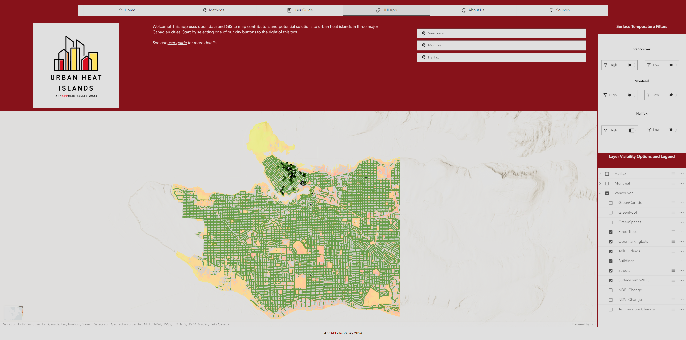

# Urban Heat Islands by Team AnnAPPolis Valley

## Team
- Megan MacDonald
- Mamadou Coulibaly
- Kowin Chen
  
## Mission statement 
According to the United States Environmental Protection Agency, heat islands result primarily from urban infrastructure, such as buildings and roads, which absorb and re-emit the sun's heat more significantly than natural landscapes like forests. This causes urban areas to have higher temperatures, hence the term "heat islands." The urban heat island (UHI) effect, a direct consequence of expanding urbanization, is of growing concern across Canada. In 2021, close to three-quarters of Canadians resided in the nation's large urban centres, indicating a significant trend towards urban living. This shift underscores the increasing importance of addressing the UHI effect. Urban areas, with their higher temperatures resulting from human activities, contrast sharply with their rural counterparts. Health Canada emphasizes that the UHI effect poses heightened heat-related health risks to a substantial portion of the Canadian population.

Our mission is to inform municipal governments, stakeholders, and organizations across Canada about how cities cause the urban heat island effect and assist them in implementing greener approaches to mitigate it. Besides using open data, the app also uses surface temperature, NDVI, and NDBI information based on Landsat imagery to provide justifiable and sophisticated answers to the urban heat island effect. Piloting in Montreal, Vancouver, and Halifax, our app gets straight into the specifics of tailoring the best overview of urban heat contributors and mitigators for each city.  
## About Our App
Our app allows you to visualize where higher and lower temperature regions are located in reference to several urban heat island contributors and mitigators. You have the option to filter surface temperature and turn on and off the variables to suit your needs. You can also view how NDVI, NDBI, and surface temperature have changed from 2013-2023.

## User Guide
This user guide focuses on showcasing our application's functionalities through the example of the city of Vancouver. However, the walkthrough is the same for whichever city is selected by the user.

Upon launching the app, a clean map interface pinpointing Montreal, Halifax, and Vancouver is presented.

Here’s how to navigate through the application's features:

### City Zoom Function:
With a simple click on the city buttons located at the top right, the application swiftly zoom into the specific urban landscape the user wishes to examine.

This zoom feature provides an immediate, detailed visual of each city's surface temperature distribution. The image below shows the map displayed when Vancouver is selected. 

### Surface Temperature Filters:
Adjacent to the city zoom buttons, the Surface Temperature Filters offer customization by toggling high and low temperatures on and off for each city. 

Enabling the high-temperature filter, for instance, isolates hotspots within the city which is essential for authorities to quickly identify and strategize cooling interventions. The image below displays the results when the high-temperature filter is activated for Vancouver. 

### Layer Visibility Options and Legend:
Below the Surface Temperature Filters, the Layer Visibility Options and Legend give users control over which data layers are visible on the map. Each layer is not only a visual tool but also a data point that can influence urban planning decisions.

All three cities have the same type of layers and here is how they should be analyzed and interpreted:
- The **Surface Temperature layer**, demonstrated through a gradient of colors, visually interprets the variation of temperature within the city, which is pivotal for identifying and analyzing urban heat islands. The deep pink zones highlight areas that are substantially warmer than the surrounding environment, indicating locations where the urban heat island effect is most pronounced. The light pink to orange areas suggests moderately elevated temperatures, which may still contribute to the heat island effect but at a reduced intensity. The transition to yellow and light green indicates areas closer to or below the city's average temperature, where the impact of urban heat islands is lessened. The significance of this layer lies in its ability to pinpoint areas of potential concern where urban expansion has led to increased temperatures, which can affect local climates, energy usage, and human health. By understanding where these hotspots are, city planners and policymakers can devise strategies to mitigate the heat island effect, such as increasing green spaces or improving infrastructure to reduce heat absorption.
- The **Parking Lots**, **Tall Buildings**, **Buildings**, and **Streets layers** are central to the study because they depict the urban footprint and its direct correlation with heat islands. These features are essential for understanding:
  + Heat Absorption and Radiation: Urban structures, especially tall buildings and concrete or asphalt surfaces like parking lots and streets, absorb and radiate heat more than natural landscapes, leading to increased temperatures.
  + Urban Planning Impact: These layers highlight the impact of current urban planning and architecture on local temperature dynamics and can guide the development of cooler, more temperature-resilient urban spaces.
  + Data-Driven Solutions: By mapping these features against temperature data, the study provides concrete evidence to support green building practices and the development of more open spaces to counteract the heat island effect.
  + Risk Assessment: They help in assessing risk and prioritizing areas for intervention by city authorities to improve living conditions and reduce energy consumption associated with cooling needs.

- The **Street Tree Layer** in this analysis represents the distribution of trees within the cities, typically aligned with roads and urban infrastructure. Despite their presence, notably in downtown areas, the persistence of heat islands reveals a crucial insight; the current greenery is insufficient to mitigate the urban heat island effect. This layer is integral to the study for several reasons:
  + Baseline for Green Infrastructure: It establishes a baseline of existing urban forestry, which is essential for understanding how much and what types of vegetation are present in heat-affected areas.
  + Effectiveness of Current Measures: The contrast between tree-covered areas and persistent heat islands underscores the need for a more effective or increased implementation of green infrastructure. This suggests that simply having trees is not enough; their placement, density, and species may all play a role in their effectiveness.
  + Strategic Planning: By highlighting areas where tree coverage does not correlate with lower temperatures, the research suggests a need for strategic planning in urban forestry. This might involve planting more trees, introducing different species, or incorporating other forms of green space.
  + Policy Implications: For authorities, this layer serves as a call to action to enhance urban planning policies. It provides a visual tool to advocate for increased funding and efforts in urban greening initiatives.
  + Public Awareness and Engagement: It can also serve to increase public awareness of the importance of trees in urban areas, potentially engaging local communities in supporting and participating in urban forestry initiatives.

- The **Canopy**, and the **Parks Layers** also named as **green spaces** are significant components of this work as they reveal the correlation between green spaces and cooler urban temperatures. Here’s why their inclusion is crucial for understanding urban heat dynamics and informing city planning:
  + Natural Cooling Mechanisms: These layers demonstrate how green spaces like parks and areas with dense tree canopies act as natural cooling mechanisms. They provide shade, reduce surface albedo, and facilitate evapotranspiration, all of which contribute to lower local temperatures.
  + Benchmarks for Urban Heat Mitigation: By showing a clear connection between cooler temperatures and green spaces, these layers serve as benchmarks for effective urban heat mitigation strategies. They offer visual proof that expanding such areas could be a key solution to urban heat problems.
  + Urban Planning and Design: For urban planners and designers, these layers highlight the successful cooling effects of parks and canopy cover, suggesting that similar green infrastructure could be used strategically in heat-prone areas to alleviate the heat island effect.
  + Health and Well-being: These green spaces are important for the analysis as they also relate to public health and quality of life. Cooler areas can reduce the risk of heat-related illnesses and provide comfortable outdoor environments for recreational and social activities.
  + Environmental Impact: Canopy and parks layers emphasize the environmental benefits of green spaces, such as improved air quality, carbon sequestration, and habitat for wildlife, all contributing to the overall ecological health of the urban area.
  + Policy Development: The clear visual correlation between green spaces and cooler areas can inform policy development. It provides a strong argument for investing in the creation and maintenance of parks and the expansion of urban canopy as a city-wide cooling strategy.

- The inclusion of **Green Corridors** and **Green Roofs** in the research is aimed at emphasizing their roles in urban temperature regulation and ecological connectivity.
  + Green corridors serve a vital function in linking larger natural areas with urban landscapes, maintaining biodiversity, and facilitating wildlife movement. These corridors can mitigate the effects of urban sprawl, acting as 'natural air conditioners' by cooling the air as it moves through them.
  + Green roofs, which are vegetated roof covers, provide important insulation for buildings, reduce urban heat through the process of evapotranspiration, and can lower the ambient temperature in their immediate surroundings.
 Both elements are present in the study to:
  + Highlight their effectiveness in reducing urban heat islands.
  + Demonstrate their contribution to sustainable urban design.
  + Advocate for their increased adoption in urban planning to enhance ecological networks and improve the urban microclimate.

- NDVI (Normalized Difference Vegetation Index) and NDBI (Normalized Difference Built-up Index) are two important indices used in remote sensing to analyze land cover changes over time.
  + NDVI is a measure of the amount and health of vegetation. An increase in NDVI values over time can indicate more greenery or healthier plant life, while a decrease suggests the opposite. It's crucial for assessing changes in green spaces within urban areas, especially with respect to urban expansion and its environmental impact.
  + NDBI helps in identifying and analyzing built-up areas like buildings and roads. An increase in NDBI values typically reflects urbanization and infrastructure development. Monitoring changes in NDBI can reveal the rate and pattern of urban sprawl.
       These indices are important for our work because they provide quantifiable data on changes in vegetation and built-up areas, offering insights into the urbanization process and its environmental effects, including the urban heat island phenomenon. The comparison of these indices from 2013 to 2023 allows for a detailed examination of urban expansion and its interplay with green spaces and built environments.
  
NDVI Change
 
NDBI Change

### Layers' Pop-up:
Zooming in and left-clicking on features of interest activates their pop-up to see additional information.

If multiple layers are activated, the top layer's pop-up will appear first. The image below shows how to navigate through them.  

The user also has the option to export the pop-up information into different formats. 

## Methodology
### Landsat imagery aquisition and processing
The methodology for analyzing urban heat islands commenced with the acquisition of Landsat 8/9 imagery for the selected cities of Montreal, Halifax, and Vancouver. The data, captured in August of both 2013 and 2023, was carefully chosen based on a cloud cover threshold of less than 10% to ensure clarity. Subsequently, the images underwent processing to compute various indices. These include the Normalized Difference Vegetation Index (NDVI), the Normalized Difference Built-up Index (NDBI), and the Modified Normalized Difference Water Index (MNDWI), using specific band calculations to quantify vegetation, urbanization, and water body extents, respectively. Additionally, the surface temperature was calculated using the thermal bands, providing a crucial metric for identifying heat island effects over time.

### Calculating Mean Changes Per Dimmeniation Area
In the second phase of our methodology, we concentrated on calculating the mean changes in surface temperature, as well as the mean changes in the indices for vegetation and urbanization, across each dissemination area. This process involved a precise treatment of the data to ensure accuracy:
1. **Removing Water Values:** MWDWI raster values were reclassified and the values representing water were set to NODATA. Next, the Surface Temperature, NDVI, and NDBI raster layers were Extracted by Mask using this layer in order to remove the areas with water since these would lower the mean values for each.
2. **Calculating NDVI and NDBI Difference**: Using raster calculator, the difference between NDVI and NDBI rasters for 2013 and 2023 were calculated. 
NDVI_DIFF = NDVI_2023 - NDVI_2013; NDBI_DIFF = NDBI_2023 - NDVI_2013
3. **Zonal Statistics As Table and Join**: Using the city dissemination areas as the zones, zonal statistics were calculated for Surface Temperature 2013 and 2023, NDVI_DIFF, and NDBI_DIFF using the statistic type set to Mean. The tables were then joined to the dissemination area polygon layer using their DAUID.
4. **Calculating Surface Temperature Difference**: Using field calculator for the enhanced dissemination area feature, the difference between the two years was calculated.  
ST_CHANGE = MEAN2023 - MEAN2013

### Open Data Processing Steps
The final stage of our methodology entailed augmenting our dataset with various open data layers to enhance the robustness of our analysis. This process is detailed as follows:
1. **Data Sourcing:** We scoured open data portals and governmental databases for each city to find relevant data layers. The datasets we found encompass Tall Buildings, Buildings, Parking Lots, Streets, Trees/Canopy, Green Spaces/Green Alleys, Green Roofs, and Green Corridors. 
2. **Data Projection:** Imported layers were standardized by converting them to the city-specific NAD 83 UTM projection to maintain consistency. 
Vancouver: NAD 83 Zone 10 
Montreal: NAD 83 Zone 18 
Halifax: NAD 83 Zone 20
3. **Spatial Refinement:** We then clipped each layer to the specific study area of each city, using the previously defined dissemination areas to maintain geographical precision.
4. **Layer Extraction:** Certain layers of interest, such as parking lots and buildings exceeding 100 meters in height, were extracted from more extensive datasets to focus on elements critical to our urban heat island analysis.
5. **Standardization of Representation:** Finally, we adjusted the symbology and names of the layers to ensure uniformity across all cities, facilitating comparative analysis and interpretation.

## Limitations
Our Urban Heat Island analysis app aims to equip users with insights into heat distribution within cities and potential mitigative strategies. However, several limitations are inherent in the current version:

- **Data Completeness:** The app does not encompass all potential data layers due to the unavailability of certain datasets. This gap could leave out factors that contribute to the urban heat island effect.
- **Data Currency:** Some layers included in the app are not up-to-date. For example, the street tree layer may not reflect recent losses due to environmental factors like storms, which affects the accuracy of the green cover analysis.
- **Data Generalization:** The conversion from raster data to polygon shapes involves generalization, leading to a loss of detail. Additionally, calculating average values per dissemination area (DA) offers only an estimate and may not capture the full complexity of the urban heat situation.
- **Building Height Data:** For the identification of tall buildings, the app relies on a threshold of 100 meters or more. However, this height data, derived from LiDAR, may inaccurately represent actual building heights, as it could include other tall structures on the rooftops, like antennas or chimneys.
- **Temporal Analysis Constraints:** The app's analysis is based on surface temperature data from only one day per year for 2013 and 2023. This limited snapshot may not fully capture the variability and trends of the urban heat island effect over time. A more extensive collection of data over multiple days, particularly during the summer season, would provide a richer, more nuanced understanding of the UHI phenomenon and its dynamics.

These limitations underscore the app's role as an estimating tool rather than a definitive solution, and highlight the ongoing need for improved data collection and processing to enhance urban environmental analysis.

## Geospatial Data Sources

### Halifax
| Name                    | Source                     | Links                                          |
|-------------------------|----------------------------|------------------------------------------------|
| Buildings               | Halifax Open Data Catalog  | https://data-hrm.hub.arcgis.com/datasets/...   |
| Street Trees            | Halifax Open Data Catalog  | https://data-hrm.hub.arcgis.com/datasets/...   |
| Street Centerlines      | Halifax Open Data Catalog  | https://data-hrm.hub.arcgis.com/datasets/...   |
| Parks                   | Halifax Open Data Catalog  | https://data-hrm.hub.arcgis.com/datasets/...   |
| Accessible Parking Spots| Halifax Open Data Catalog  | https://data-hrm.hub.arcgis.com/datasets/...   |
| Canopy                  | GeoNova DataLocator        | https://nsgi.novascotia.ca/gdd/                |

### Montreal
| Name                                            | Source                           | Link                                                                                                        |
|-------------------------------------------------|----------------------------------|-------------------------------------------------------------------------------------------------------------|
| Buildings                                       | Natural Resources Canada         | https://ftp.maps.canada.ca/pub/nrcan_rncan/extraction/auto_building/shp/                   |
| Streets                                        | Statistics Canada                | https://www12.statcan.gc.ca/census-recensement/2011/geo/RNF-FRR/index-eng.cfm       |
| Canopy                                          | Government of Quebec             | https://www.donneesquebec.ca/recherche/dataset/canopee-des-six-rmr-du-quebec/resource/c97ffac0-47f2-493c-b231-c68d9f3a9785) |
| Green Alleys                                    | Government of Quebec             | https://open-data-portal-metrovancouver.hub.arcgis.com/datasets/5dd153684b9b41249c0dcf09e79c9b25/about |
|Green Spaces                                     |Government of Quebec               | https://open.canada.ca/data/en/dataset/2e9e4d2f-173a-4c3d-a5e3-565d79baa27d

### Vancouver
| Name                                  | Source                           | Link                                                                                                        |
|---------------------------------------|----------------------------------|-------------------------------------------------------------------------------------------------------------|
| Buildings                             | Natural Resources Canada         | https://ftp.maps.canada.ca/pub/nrcan_rncan/extraction/auto_building/shp/                  |
| Green Roofs                           | Roofpedia                        | https://github.com/ualsg/Roofpedia/blob/main/results/04Results/Roofpedia%20Results/Green/Vancouver_Green.geojson |
| Street Trees                          | City of Vancouver Open Data      | https://opendata.vancouver.ca/explore/dataset/street-trees/information/                   |
| Parking Lots: Extracted from Land Cover Classification 2020 (raster) | Metrovancover Open Data          | https://open-data-portal-metrovancouver.hub.arcgis.com/datasets/5dd153684b9b41249c0dcf09e79c9b25/about |
| Streets                               | City of Vancouver Open Data      | https://opendata.vancouver.ca/explore/dataset/public-streets/information/              |
| Green Spaces                          | City of Vancouver Open Data      | https://opendata.vancouver.ca/explore/dataset/parks-polygon-representation/information/                         |
| Greenways                             | City of Vancouver Open Data      | https://opendata.vancouver.ca/explore/dataset/greenways/information/                        |

### Common Sources To The Three Cities
| Name                    | Source                     | Links                                          |
|-------------------------|----------------------------|------------------------------------------------|
| Satellite Imagery 2013  | USGS Earth Explorer        | https://earthexplorer.usgs.gov/                |
| Satellite Imagery 2023  | USGS Earth Explorer        | https://earthexplorer.usgs.gov/                |
| Dissemination Areas     | Statistics Canada          | https://www150.statcan.gc.ca/n1/en/catalogue/92-169-X|

## References
### Online Articles and Websites 
1. Canada Population. (2024). Halifax Population 2024. Retrieved from https://www.canadapopulation.net/halifax-population/
2. Environment and Climate Change Canada (n.d.). Reducing Urban Heat Islands to Protect Health in Canada. Health Canada. Retrieved from  
https://www.canada.ca/en/services/health/publications/healthy-living/reducing-urban-heat-islands-protect-health-canada.html
3. Statistics Canada. (2022). Canada's large urban centres continue to grow and spread. Retrieved from  
https://www150.statcan.gc.ca/n1/daily-quotidien/220209/dq220209b-eng.htm
4. Statistics Canada. (2022). Census of Environment: Urban greenness, 2022. Retrieved from  
https://www150.statcan.gc.ca/n1/daily-quotidien/221117/dq221117e-eng.htm
5. Statistics Canada. (2023). Census of Environment: Urban greenness, 2023. Retrieved from  
https://www150.statcan.gc.ca/n1/daily-quotidien/231115/dq231115c-eng.htm
6. Statistics Canada. (2022). Population Growth in Canada's Large Urban Centres. Retrieved from  
https://www150.statcan.gc.ca/n1/daily-quotidien/220209/g-b001-eng.htm
7. U.S. Environmental Protection Agency (n.d.). Learn About Heat Islands. Retrieved from  
https://www.epa.gov/heatislands/learn-about-heat-islands
8. U.S. Environmental Protection Agency (n.d.). Using Trees and Vegetation to Reduce Heat Islands. Retrieved from  
https://www.epa.gov/heatislands/using-trees-and-vegetation-reduce-heat-islands
9. U.S. Environmental Protection Agency (n.d.). Using Green Roofs to Reduce Heat Islands. Retrieved from  
https://www.epa.gov/heatislands/using-green-roofs-reduce-heat-islands
10. U.S. Environmental Protection Agency (n.d.). Using Cool Pavements to Reduce Heat Islands. Retrieved from  
https://www.epa.gov/heatislands/using-cool-pavements-reduce-heat-islands

### Images
1. Cool Roof - Photo by Michael Jasmund on Unsplash
2. Downtown Montreal by manumilou is licensed under CC BY-SA 2.0.
3. Green Roof - Photo by CHUTTERSNAP on Unsplash
4. Halifax harbour Sunset Skyline by Tony Webster is license under CC BY-SA 2.0.
5. Pavement - Photo by Annie Spratt on Unsplash
6. Vancouver Skyline and Mountains HDR by keepitsurreal is licensed under CC BY-SA 2.0.

### Videos
1. CN Tower - Video by Teresa Lencastre: https://www.pexels.com/video/a-low-angle-view-of-cn-tower-surrounded-with-city-buildings-14365434/ 
2. Halifax Apartments - Video by Max Medyk: https://www.pexels.com/video/drone-footage-of-apartment-buildings-in-the-coastal-city-of-halifax-canada-15615378/
3. Halifax Coast - Video by Max Medyk: https://www.pexels.com/video/drone-video-of-the-coastal-city-of-halifax-canada-15615432/
4. Halifax Waterfront - Video by Max Medyk: https://www.pexels.com/video/downtown-halifax-skyscrapers-by-the-sea-5188846/
5. Montreal Downtown - Video by Patrick Tomasso: https://www.pexels.com/video/compilation-videos-of-montreal-canada-landmarks-and-scenery-3881018/
6. Montreal Driving - Video by German Korb: https://www.pexels.com/video/city-buildings-driving-free-4370833/
7. Montreal Highway Overpass - Video by German Korb: https://www.pexels.com/video/road-systems-in-montreal-canada-for-traffic-management-of-motor-vehicles-3727445/
8. Ontario Place - Video by Harrison Haines: https://www.pexels.com/video/drone-footage-of-ontario-place-8318958/
9. Trees in City - Video by TripAway 2Day: https://www.pexels.com/video/footage-of-waterfall-in-the-jewel-changi-airport-7031954/
10. Vancouver (4265473) - Video by Dmitry Varennikov: https://www.pexels.com/video/city-clouds-haze-travel-4265473/
11. Vancouver at Night - Video by Corentin Jacquemaire: https://www.pexels.com/video/canada-vancouver-19220171/
12. Vancouver, sea clouds - Video by Dmitry Varennikov: https://www.pexels.com/video/sea-of-clouds-in-the-city-5558816/
13. Video by Kelly (2330708) - A shallow river streaming through a bed of rocks: https://www.pexels.com/video/a-shallow-river-streaming-through-a-bed-of-rocks-2330708/
14. Trees (2882118) - Video by Kelly: https://www.pexels.com/video/plants-clinging-by-the-tree-branches-in-a-forest-2882118/
