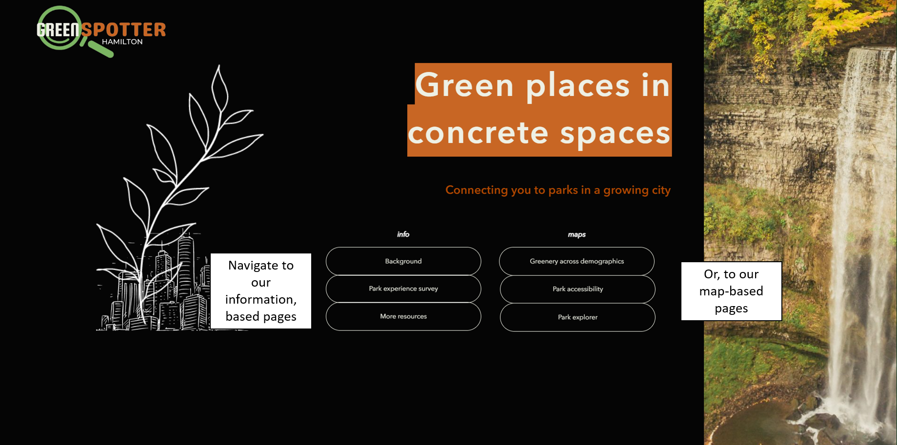
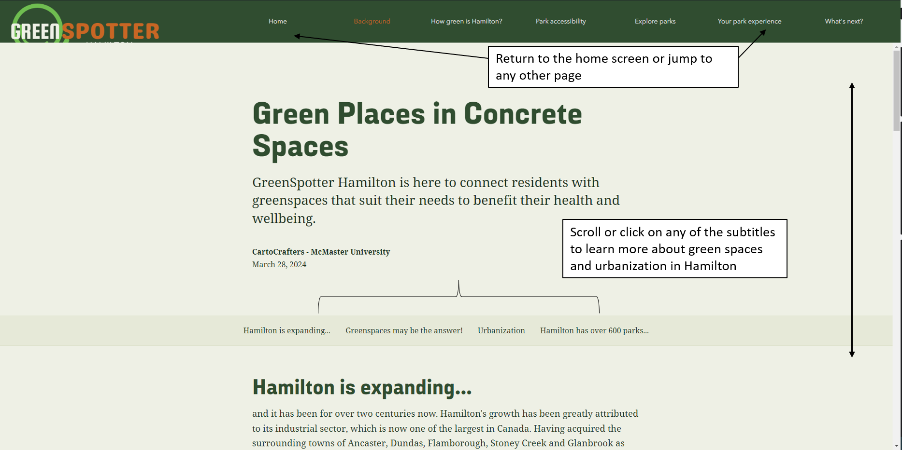
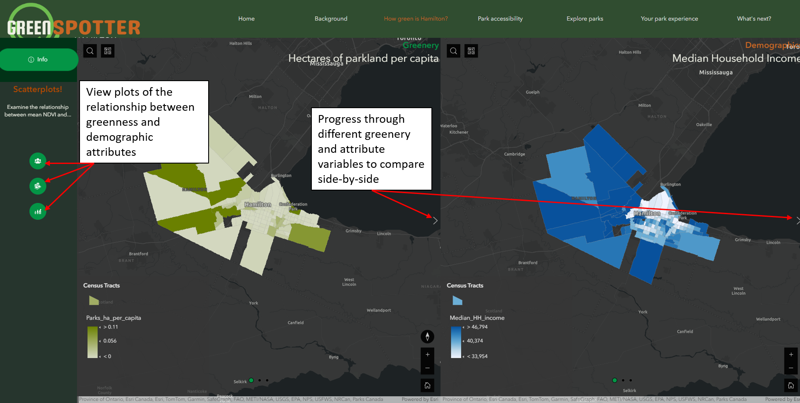
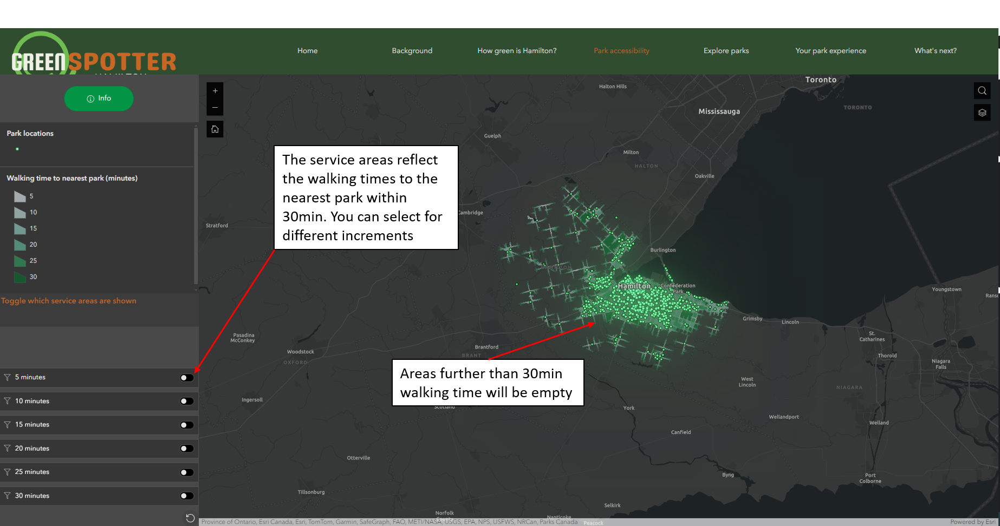
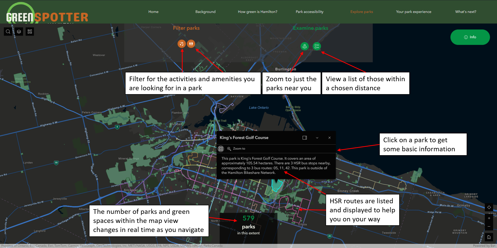
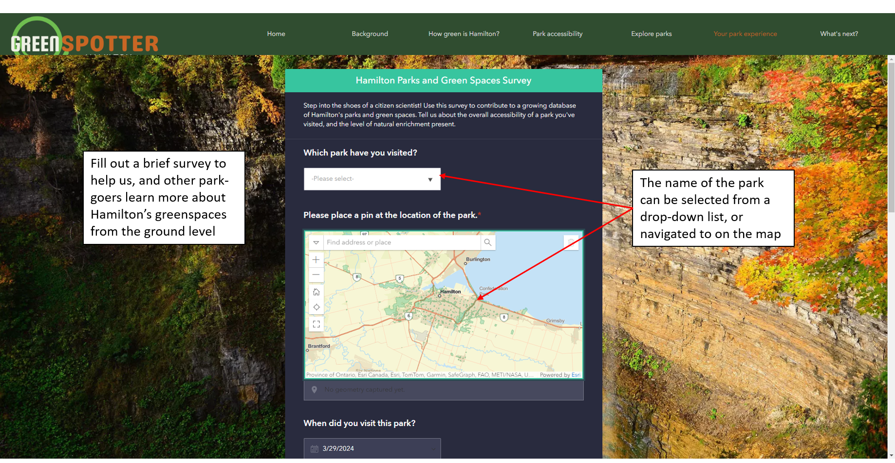
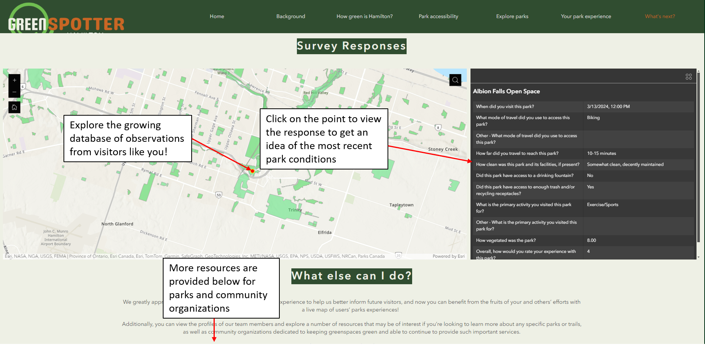
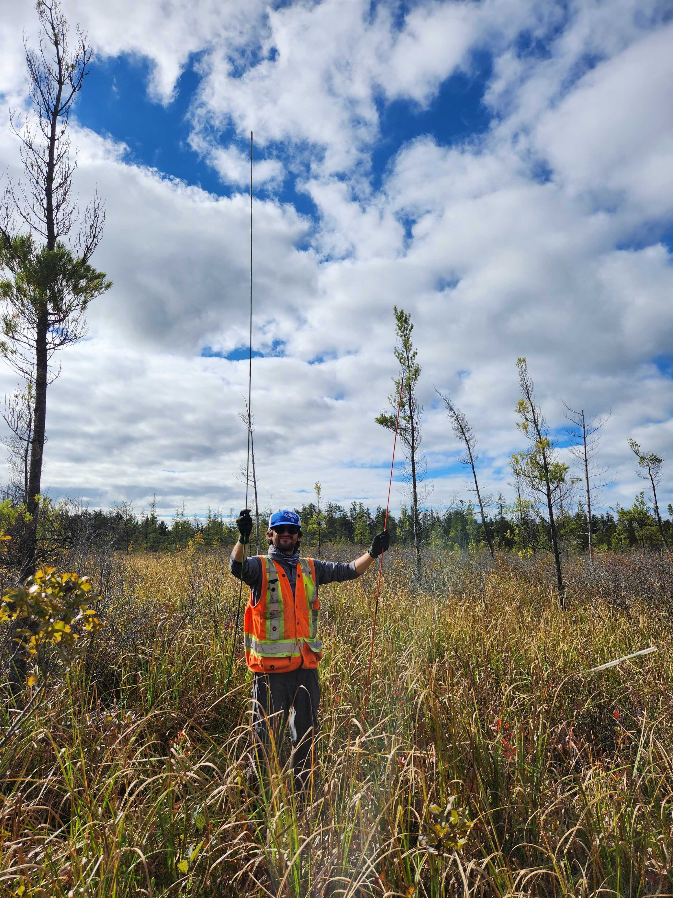

# GreenSpotter Hamilton

## Mission Statement

Our mission is to provide a comprehensive and interactive guide to Hamilton’s over 5700 hectares of parks and green space, which are under pressure from a rising demand for usage and land from a rapid urbanization and population growth. On top of being a handy tool for finding parks that meet one’s needs, we aim to build a picture of where there are green space ‘deserts’ in terms of coverage and accessibility. We aim to make this picture clearer as the user is empowered to contribute to a growing database so that information better reflects the state of green spaces at the ground level. 

## About the App
GreenSpotter Hamilton explores the City of Hamilton’s parks and greenspaces in terms of what they have to offer and how accessible they are, both at the citywide level and the typical individual looking to go for a hike or picnic. It introduces the user to the importance of parks and green spaces to human mental and physical health, along with the threats being faced along with urban expansion, which applies pressure from a use, space and transportation perspective. Across the city, GreenSpotter assesses how ‘green’ communities are, and how much green space is available to their residents to find those underserved by this infrastructure. From a transportation standpoint, the app provides a view of how far one has to travel to reach a park, as urban sprawl has created a type of accessibility ‘desert’ should one lack access to a personal vehicle. 

Perhaps the star of the show for the average user (and can be jumped to from the get-go) is GreenSpotter’s guide to Hamilton’s parks and greenspace, which has enriched Open Hamilton’s datasets with those of the province of Ontario and the Hamilton Conservation Authority to provide a comprehensive ability to filter based on location, amenities, and activities for the user’s next park visit. After reaching one of these spaces (such as by HSR) for some wellness benefits, the app offers a survey to crowdsource a live database that can better inform the next park-goers and raise attention to any issues of green space health that can be addressed by Parks staff or be the focus of community clean-up efforts. While distinctly local to the City of Hamilton, GreenSpotter can serve as a framework for any city to assess the status of their parks and greenspaces, make them more accessible to residents and crowdsource a more complete picture of what’s going on at the ground level of these spaces

## App Overview

As Earth’s population has grown, our cities have needed to grow with it. It’s estimated that around 80% of Canada’s population is concentrated in urban areas (cities and towns with populations greater than 1000) (reference). While urban expansion has its benefits such as access to infrastructure, a notable detriment has been its encroachment on green spaces, which provide ecosystem services and provide mental and physical health benefits to residents (European Commission, 2016). Statistics Canada observed that urban greenness levels through NDVI (normalized difference vegetation index) decreased in many urban population centres experiencing population growth over the past 18 years (Lantz et al., 2021). In particular, 38.1% of Ontario’s population centres experienced a decrease in urban greenness from 2001-2019, including the City of Hamilton. 

This comes as little surprise, as Hamilton is seeing considerable urban growth on several fronts. Notably, the recent 2021 census reported the city’s 6% population growth from 2016 which exceeded the national average as it added over 32,000 new residents (Statistics Canada, 2023). Along with this came an increase of total occupied dwellings by 5.3% or 11,205 units. This trend appears to be continuing (Urciuoli, 2023). This is on top of a downtown core that is among the most densely populated in Canada (Mitchell, 2022). This development puts land use in competition and puts increased stress on Hamilton’s 57.4 sq.km of parks and greenspace, which represent just over 5% of its area.

## Homescreen

In this start-up page, we present our team’s mission statement for GreenSpotter Hamilton, brief overviews of its pages and the ability to navigate to any of them. You can choose to move onto Background if you are seeking more information on greenspaces and urbanization in Hamilton, or you can jump immediately to Explore if you’re looking to spend some time in a park or green space.

## Background

This StoryMap sets the stage for the impetus behind this app. We provide some basic information on greenspaces and the science behind their importance for ecosystem services and human well-being. With urbanization, however, this greenspace may be paved over by encroaching sprawl or squeezed tighter by densification. This can be seen distinctly in the contrast of a satellite view of Hamilton from a few decades ago to today, a timespan during which the area has added over 200,000 residents. This comparison of ‘greenness’ is also made across the city based on the average NDVI (derived from recent Sentinel-2 imagery) for each census tract. While much of the disparity can be attributed to the greater amount of development towards Hamilton’s downtown (one of the most densely populated in Canada according to the 2021 census), we aim to paint a greener rather than grey picture by bringing to attention the over 600 parks and greenspaces that account for only 5% of its area but punch above their weight in making the urban jungle more livable for all.

## How ‘green’ is Hamilton?

Viewed another way, still using Hamilton’s census tracts as our unit of measurement, this page provides linked views of the city’s parks per capita or greenness against major demographic variables such as income. These maps can be used to identify which neighbourhoods are relative greenspace ‘deserts’ or whose parks must support higher numbers of residents, especially those of lower income who may be disproportionately impacted. From a planning perspective, this can be a powerful tool to mitigating these gaps and ensuring those greenspaces in high demand areas are well maintained and healthy.

## Accessibility of parks

This map-based page offers a different perspective on the matter of greenspaces; their accessibility throughout the City of Hamilton based on different modes of transportation. The service areas shown by default depict the area where one is within a 5-30 min walk from the nearest park, keeping in mind that individuals will be more likely to use such spaces if they can be accessed without hardship and that some may not have personal vehicles. The picture changes considerably, as the access to greenspace ‘deserts’ have now shifted elsewhere, where the lack of any coverage means they are beyond the typical max walking travel time. The opportunities expand considerably, however once one shifts to viewing based on driving times.

## Explore Hamilton’s parks

This powerful tool offers a myriad of functionality to help the user find the park (or parks) closest to them, and those that meet their needs. From the get-go, the number of parks within the map extent is provided and updated in real time as one navigates around the city or to their current location. Alternatively, a location can be selected with a marker placed on the map using the Parks near me function to return parks within a set buffer size. Dual filters, ‘Filter Parks’ for amenities and accessibility and “Filter by Activities” can be used to narrow down the options to specifics such as those with an accessible washroom, HSR bus stops nearby, and a baseball field. Transit options such as HSR bus routes and bikeshare hubs are included on the map with the parks to help with planning how to get there. Directions…

This dataset of parks comprises locations from Open Hamilton, along with the conservation and natural areas managed by the Hamilton Conservation Authority. Transport accessibility is assessed based on public transit (nearby Hamilton Street Railway (HSR) bus stops, and HSR routes), bicycle (Hamilton bike share coverage, bike parking and Ontario Trail Network (OTN) connectivity) and by car (parking lots). The parks’ amenities and activities are assessed based on washrooms, sports fields, campgrounds, and nearby recreation centres and tourism points of interest. Lastly, the natural value of the parks and greenspaces are evaluated based on the presence of water bodies and ‘greenness’ based on its mean NDVI derived from Sentinel-2 imagery.

## Your Parks Experience

Some aspects of greenspaces can only be discerned at the ground-level, so we provide the user the opportunity to contribute to a growing database of Hamilton’s parks with Survey123 integration. With this brief survey, we aim to build a clearer picture of the quality/status of greenspace in real time, along with real utilization and accessibility data from the communities they serve. The user can also step into the shoes of a citizen scientist by assessing the kinds of natural enrichment present in the greenspace, which is closely tied to the biodiversity it supports.

## What’s next?

We greatly appreciate you providing any input on your parks experience to help us better inform future visitors, and now you can benefit from the fruits of your and others’ efforts with a live map of users’ parks experiences!  

Additionally, you can view the profiles of our team members and explore a number of resources that may be of interest if you’re looking to learn more about any specific parks or trails, as well as community organizations dedicated to keeping greenspaces green and able to continue to provide such important services.

## _Meet Team CartoCrafters_

#### **Alex Furukawa**
I am a fourth year Ph.D of Earth and Environmental Sciences in the Mac Ecohydrology Lab and an ECCE student associate. My research explores the hydrological dynamics of the peatlands of the Boreal Shield and how that influences their resilience to climate change and wildfire. I’ve been a long-time teaching assistant for GIS at McMaster since my M.Sc and integrate it into my field-based research wherever I can. When I’m not in the outdoors for science reasons I also love hiking and fishing, though not typically in peatlands.

#### **Farah Chin** 
I’m in my final year of the Honours Mathematics and Biology program, and pursuing a certificate in GIS. I’m particularly interested in the application of GIS techniques and spatial statistics to topics in epidemiology and public health. I’m currently working as an assistant in the Lloyd Reeds Map Collection, where I'm working on a project exploring the development of 19th century polar maps in conjunction with scientific expeditions. In my spare time I’m usually crocheting, playing Zelda, or watching horror movies.

 

#### **Leah Smith**
I am a fourth-year Honours Integrated Science student (Conc. Earth & Environmental Science) and an ECCE student associate. I am currently pursuing a concurrent certificate in GIS, as well as PGO certification. I am currently working on my undergraduate thesis, evaluating badland susceptibility in Basilicata, Italy, through a regression-based MCE approach. Outside of academia, I can be found listening to my latest Spotify Daylist, playing my ukulele, sending my friends Reels, or rehearsing for the MacSci Musical.

## References and Data Sources

Contains public sector Data made available under the City of Hamilton’s Open Data Licence

Copernicus Sentinel data [2023]. Retrieved from Earth Engine Data Catalog [27-March-2024], processed by ESA.

European Commission, 2016, “Urban ecosystems,” Mapping and Assessment of Ecosystems and their Services, 4th report, https://ec.europa.eu/environment/nature/knowledge/ecosystem_assessment/pdf/102.pdf (accessed March 27, 2024)

Government of Ontario; Ministry of Natural Resources and Forestry, Provincial Mapping Unit (2021) Ontario Trail Network (OTN) [online]: Available from https://geohub.lio.gov.on.ca/datasets/mnrf::ontario-trail-network-otn-segment/explore 

Lantz, N. , Grenier, M. and Wang, J. (2021) Urban greenness, 2001, 2011 and 2019. Envirostats 16-002-X, Statistics Canada. https://www150.statcan.gc.ca/n1/pub/16-002-x/2021001/article/00002-eng.htm 

Mitchell, Don. “Census 2021: Hamilton’s downtown among the most densely populated in Canada.” Global News, February 15, 2022, https://globalnews.ca/news/8620660/census-2021-hamilton-downtown-densest-canada/ 

Statistics Canada. 2023. (table). Census Profile. 2021 Census of Population. Statistics Canada Catalogue no. 98-316-X2021001. Ottawa. Released November 15, 2023.
https://www12.statcan.gc.ca/census-recensement/2021/dp-pd/prof/index.cfm?Lang=E  (accessed March 29, 2024). 

Urciuoli, Anthony, “More homes being built in Hamilton than ever. Are we ready for the population boom?” insauga, March 6, 2023, https://www.insauga.com/more-homes-being-built-in-hamilton-than-ever-are-we-ready-for-the-population-boom 

