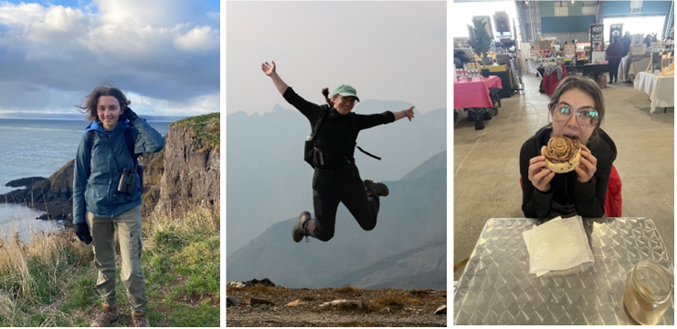

# SHE's in Stem
## 2024 ESRI App Challenge  
### Who are we?
Hi, we are **SHE's in STEM**. Our team name is an acronym of all our members: **S**asha, **H**annah, and **E**velyn. We are three environmental sciences students at Dalhousie Univerisity (in Halifax!). We are passionate about GIS applications for conservation and sustainbility.

## The Members

### Sasha Chilibeck (left)

My name is Sasha, and I am currently a fourth-year undergraduate student studying Environmental Science and Biology at Dalhousie University, with specialization in GIS and Environmental Impact Assessment. Throughout my studies, I’ve greatly enjoyed exploring GIS applications and remote sensing to enhance my research interests, particularly in wetland and bird conservation. I hope to enhance my technical skills to help me pursue a competitive Master’s program in the realm of ornithology. When not in a study lounge, I can be found making artwork, reading, hiking, or birdwatching.  

### Hannah Freeman (middle)

My name is Hannah, and I am a fourth-year undergraduate student completing my Bachelor of Science Honours degree in Environmental Science with certificates in GIS and Environmental Impact Assessment. My thesis relates to measuring reproductive activity of Olive-sided Flycatcher, a bird SAR, that inhabit forests harvested using best management practices. I am passionate about avian conservation and discovering more about the ways that GIS can be used to advance our understanding of habitat suitability and migratory flyways.   

### Evelyn Rusnak (right)

My name is Evy, and I am a fifth-year undergraduate student at Dalhousie University completing an Honours degree in Environmental Sciences and Marine Biology. My honours thesis uses remote sensing methodologies to assess the impacts of forest management practices on forest stand albedo and surface temperatures. On the weekends I love to surf and snowboard around Nova Scotia or curl up with a good murder mystery and some popcorn. I am passionate about using GIS techniques to inform conservation and policy, and I hope to continue this work in graduate school (ideally somewhere with waves!).  

 

## What did we do?
Urban expansion has so many levels, so we decided to tackle vertical expansion, AND because we are environmental scientists, we thought about how important it is to build BIRD FRIENDLY CITIES! So our team's goal was to map the bird-building strike risk in Toronto, and create an interactive app that citizens can use to view high-risk bird strike zones. Users can search by address, and are shown the overall risk of bird-strikes as well as the highest risk factors in that area. We also included some great resources to actions that help reduce bird strikes!

## Mission Statement
The Concrete Migration application integrates spatial data concerning urban features in Toronto subdivisons that have been identified as decreasing the suitability of bird habitat in that area. The individual impact of each feature, as well as a combined suitability index, is displayed in our app to highlight areas of high/low imapct, and the they way that impacts from various features vary across the city. 

This app does not consider all urban features that may negatively influence bird suitability. Factors such as light and air pollution, and spaces where pesticides or herbicides are applied, were excluded due to lack of available data. Additionally, characteristics that positively impact suitabiliy were omitted intentionally, as we aimed to draw attention to the negative factors affecting bird well-being. Given this, as well as limitations highlighted within our methodology, Concrete Migration should not be used as a sole indicator of bird suitability in Toronto. 

Instead, this platform is designed for citizens interested in educating themselves on the issue at hand, and encouraging those involved in vertical or horizonal expansion associated with urban densification in Toronto to consider our feathered friends in the decision-making processes behind urban design, building construction, and related expansion activities. 

The following questions are some we hoped to answer in the Concrete Migration: 

What urban features threaten birds in Toronto? 
How do the below urban features impact birds differently across Toronto? 
- Building Height 
- Wind Turbines 
- Highways 
- Bus Shelters 
- Built Area (Normalized Difference Built Index) 
- Power Lines 

When considering the combined effect of all features, how does bird suitability vary across Toronto? 
How does our predicted suitability index compare to citizen science bird strike reports?

## Concrete Migration: the website
[Concrete Migration](https://cm22-dalspatial.hub.arcgis.com/pages/application) aims to inform citizens of the level of threats that face birds in their neighborhoods based on urban environmental design. We hope that citizens looking to expand or change their urban environments, whether it be through a house renovation or voting for new amenities in their neighborhood, will use our app to approach urban design in a bird-friendly way.  
*We recommend that users do not approach our app as a definitive answer to how urban expansion impacts birds in their area, but as an informative tool for future planning and citizen science efforts.*

## How to use our Application: 
Here is a quick online demonstration about our app. For a full walk through reference our video.
### Suitability model and address searching
 *This map represents the overall suitability of Toronto based on urban expansion features that threaten birds. Areas with high risk of causing bird mortalities appear in red, while areas that are more bird friendly appear in green. Type in your address to determine the risk to birds presented by the urban structures in your area!*

### The Layers

**NBDI** stands for Normalized Built Difference Index, and is essentially a measurement of non-natural, man-made surfaces derived from satellite data. This map summarizes where pavement, concrete, steel, and other non-natural surfaces dominate the city in high densities. 

Birds often migrate at night and become confused by reflections off glass and metal surfaces, or by unnatural lighting. Considering that many of Toronto’s tallest buildings are stylized with largely glass and metal surfaces, we considered high-rise buildings to be threatening to birds. We also accounted for high density of buildings of multiple heights by including the sum of **building heights** in our Overall Suitability. 

**Roads** have mixed impacts on birds depending on the habitat surrounding them. We operated under the assumption as a city in a forested region, roads would have negative impacts on birds considering they may try to fly across major highways to access treed habitat on either side. 

**Powerlines** influence bird mortality risk by creating another difficult-to-spot collision hazard for fast-moving birds with poorer vision. They may also introduce mortality through increased predator attraction, such as acting as perches for birds of prey to enable them to swoop down on small bird species. 

**Bus shelters** are probably not what would pop into your head as a bird infrastructure threat, but their clear sidings and low height make them difficult for birds to differentiate from their surrounding environment when flying fast and low to the ground. FLAP records show multiple instances of killed birds found directly next to bus shelters. 

**Wind turbines** are well-known for causing bird mortalities. Their moving blades and white colour make them difficult for flying birds to maneuver around. They pose a very high risk to birds, especially ones that tend to soar in search of food like hawks and gulls. 

*This map shows our suitability modelling overlain with FLAP Canada data on bird strikes reported by the citizens of Toronto in the spring migration season of 2023. FLAP Canada records if the birds were found dead, alive, in flocks (multiple), if no bird were found but evidence of a strike was present (e.g., powdery outline of bird on window), or if information was unreported (unknown). You too can contribute to this dataset through* [Flap Canada](https://flap.org)

## Open Source Data
All open source data was used in the creation of this app, and processin was done on ArcGIS Pro/Experience Building/Hub

Urban Environment Data: 

We obtained the urban features data, which included wind turbines, powerlines, highways, bus shelters, building height, study area, and neighborhoods from the City of Toronto’s Open Data webpage (City of Toronto, n.d.). 
https://www.toronto.ca/city-government/data-research-maps/open-data/

Underlying this, we used a Normalized Difference Built-up Index to highlight pavement and Normalized Difference Vegetation Index to view vegetated features, such as green spaces, that provide habitat for birds. Indices were obtained from Landsat 9 data of Toronto on the U.S. Geological Society’s (USGS) Earth Explorer database. 
https://earthexplorer.usgs.gov/ 

Bird Data: 

Finally, we obtained bird sightings density from the Cornell Lab of Ornithology’s citizen science platform eBird and bird strikes from FLAP’s Global Bird Collision Mapper. All occurrence data is from April 1, 2023 to June 30, 2023, in order to capture data from spring migration.
https://birdmapper-flap.hub.arcgis.com/

## Acknowledgements 

All of us on the SHE’s in STEM team would like to thank Dr. Chris Greene for his help and support with this project, and Dr. Lexie Arnott, for inspiring us when times got tough.  

## Content References: 

Environment and Climate Change Canada (ECCC). (2021 July 30). Protect birds – Protect Nature Challenge. Government of Canada. https://www.canada.ca/en/environment-climate-change/services/nature-legacy/activities/protect-birds.html  

Fatal Light Awareness Program (FLAP) Canada. (2022). FLAP Canada data: Top 20 bird species – victims of bird-building collisions (GTA). https://flap.org/data/  

Kroeger, S.B., Hanslin, H.M., Lennartsson, T., D’Amico, M., Kollmann J., Fischer, C., Albertsen, E., & Speed, J.D.M. (2022). Impacts of roads on bird species richness: A meta-analysis considering road types, habitats and feeding guilds. https://doi.org/10.1016/j.scitotenv.2021.151478  

Lenda, M.L., Skórka, P., Jaźwa, M., Lin, H.-Y., Nęcka, E., Tryjanowski, P., Moroń, D., Knops, J.M.H., & Possingham, H.P. (2023). Recognizing the importance of near-home contact with nature for mental well-being based on the COVID-19 lockdown experience. Ecology & Society, 28(3), Article 13. https://doi.org/10.5751/ES-14374-280313  

Machtans, C.S., Wedeles, C.H.R., & Bayne, E.M. (2013). A first estimate for Canada of the number of birds killed by colliding with building windows. Avian Conservation and Ecology, 8(2), 6. https://doi.org/10.5751/ACE-00568-080206  

Nature Canada. (2024). Bird Friendly City: A certification program. https://naturecanada.ca/defend-nature/how-you-help-us-take-action/bfc/  

PerkyPet. (n.d.) Bird Migration: Birds of the Atlantic Flyway. https://www.perkypet.com/articles/atlantic-flyway-migration   

PerkyPet. (n.d.) Bird Migration: Birds of the Mississippi Flyway. https://www.perkypet.com/articles/mississippi-flyway-migration   

Rosenberg, K.V., Dokter, A.M., Blancher, P.J., Sauer, J.R., Smith, A.C., Smith, P.A., Stanton J.C., Panjabi, A., Helft, L., Parr, M., & Marra, P.P. (2019). Decline of the North American avifauna. Science, 366(6461), 120-124. https://doi.org/10.1126/science.aaw1313  

Statistics Canada (StatsCan). (2022 February 9). Canada’s large urban centres continue to grow and spread. Government of Canada. https://www150.statcan.gc.ca/n1/daily-quotidien/220209/dq220209b-eng.htm  

Zieris, P., Freund, S., & Kals, E. (2023). Nature experience and well-being: Bird watching as an intervention in nursing homes to maintain cognitive resources, mobility, and biopsychosocial health. Journal of Environmental Psychology, 91. https://doi.org/10.1016/j.jenvp.2023.102139  
