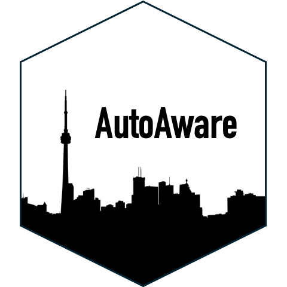
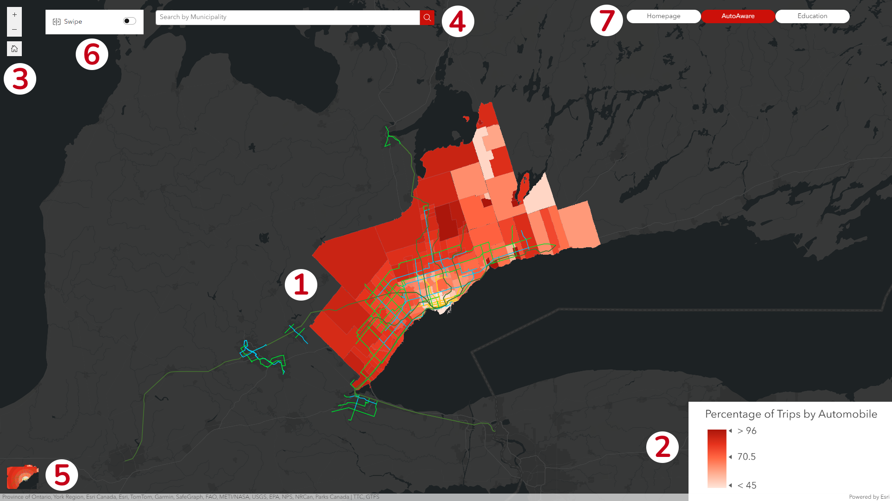

# AutoAware

Urban sprawl is the unchecked expansion of cities beyond their borders, typically in the form of low-density suburbs. These communities are heavily automobile-reliant, and therefore contribute to the ongoing climate crisis.

## **Our Mission** ##

As students in McMaster University’s School of Earth, Environment, and Society, we have all taken courses in the realms of urban planning and sustainability. Our knowledge of the area allowed us to immediately recognize the topic of urban sprawl as one of the greatest issues plaguing North American cities in the 21st century. We aim to educate a broader population about this issue, since it impacts all residents of Western societies.

With the mass adoption of the automobile among North American households in the 20th century, individuals were granted a new liberty to travel outside of their cities. Alongside these new freedoms came a change to the urban form of our communities. Cities began expanding well beyond their limits, as families sought more space, cheaper land, and to flee the industrialized inner cities. With this, the suburbs were founded.

After a century of expansion, we are now grappling with the issues brought on by urban sprawl, particularly due to the reliance of suburban communities on personal automobiles. The system of automobility has led to mass decaying infrastructure, lack of access to job opportunities, and especially disastrous environmental consequences. In our current era, we are now shifting our focus to making less automobile-dependent communities, with the outsize environmental impacts of personal car use in mind.

Our team seeks to examine how urban sprawl relates to automobile usage and air pollution in the Greater Toronto Area. While the GTA is centered on the dense urban core of Toronto, the peripheral zones are overwhelmingly composed of low-density, suburban, single-family homes which are largely automobile-dependent. Densifying these communities will be an uphill battle, however their automobile dependence can be supplemented by transit systems which connect them to major destinations, such as southern Ontario’s GO Train system.

## **About the App** ##

The application we have developed examines how automobile use increases with distance from the city centre, as a proxy variable for air pollution. We also use municipal and regional transit systems to examine the impacts of these networks on automobile use. While our application does not directly measure air pollution, we maintain a focus on this aspect of automobile use through an education section.

We hope that demonstrating the positive impacts of densification and provision of transit on air pollution, will inspire more municipalities to initiate responses in the form of urban planning initiatives in this area. It is the responsibility of all to make our communities more environmentally-friendly, and that begins at the planning level. 

## **How to use AutoAware** ##

### Interface ###

Get started with AutoAware with one of many data filtering tools available.

#### 1 ####
The map! Click on any feature to view detailed statistics about automobile usage for the specified region.

#### 2 ####
The legend! Represents the Percentage of Trips by Automobile for every region, normalized across all data points in the app.

#### 3 ####
Zoom buttons! Click the "+" and "-" buttons to zoom in and out, or click the "home" button to return to the default map extent.

#### 4 ####
Search! Use this field to search by municipality within the GTA. The map will automatically zoom to the extent of the selected municipality.

#### 5 ####
Map toggle! Click the map icon here to toggle between municipality/ward data (the default) and a map containing averaged data for concentric rings of sprawl outward from Toronto's city centre.

#### 6 ####
Swipe tool! Enable this tool for a visual comparison between the two toggleable maps.

#### 7 ####
App navigation! Click any of the buttons here to navigate to different pages of the app.

### References ###

Alam, S., & Khan, A. (2020). The Impact of Vehicular Pollution on Our Environment . IJSART, 6(12).

Bauernschuster, S., Hener, T., & Rainer, H. (2017). When Labor Disputes Bring Cities to a Standstill: The Impact of Public Transit Strikes on Traffic, Accidents, Air Pollution, and Health. American Economic Journal: Economic Policy, 9(1), 1–37. https://doi.org/10.1257/pol.20150414

Bel, G., & Holst, M. (2018). Evaluation of the impact of Bus Rapid Transit on air pollution in Mexico City. Transport Policy, 63, 209–220. https://doi.org/10.1016/j.tranpol.2018.01.001

Crowley, D. F., Shalaby, A. S., & Zarei, H. (2009). Access Walking Distance, Transit Use, and Transit-Oriented Development in North York City Center, Toronto, Canada. Transportation Research Record: Journal of the Transportation Research Board, 2110(1), 96–105. https://doi.org/10.3141/2110-12

Giles-Corti, B., Vernez-Moudon, A., Reis, R., Turrell, G., Dannenberg, A. L., Badland, H., Foster, S., Lowe, M., Sallis, J. F., Stevenson, M., & Owen, N. (2016). City planning and population health: a global challenge. The Lancet (British Edition), 388(10062), 2912-. https://doi.org/10.1016/S0140-6736(16)30066-6

Gnap, J., Šarkan, B., Konečný, V., & Skrúcaný, T. (2020). The Impact of Road Transport on The Environment. In A. Sładkowski (Ed.), Ecology in Transport: Problems and Solutions (pp. 251–309). Springer.

Guo, S., & Chen, L. (2019). Can urban rail transit systems alleviate air pollution? Empirical evidence from Beijing. Growth and Change, 50(1), 130–144. https://doi.org/10.1111/grow.12266

Jackson, L. E. (2003). The relationship of urban design to human health and condition. Landscape and Urban Planning, 64(4), 191–200. https://doi.org/10.1016/s0169-2046(02)00230-x

Næss, P. (2005). Residential location affects travel behavior—but how and why?: The case of Copenhagen Metropolitan Area. Progress in Planning, 63(2), 165–165. https://doi.org/10.1016/j.progress.2004.08.002

Nagel, C. L., Carlson, N. E., Bosworth, M., & Michael, Y. L. (2008). The Relation between Neighborhood Built Environment and Walking Activity among Older Adults. American Journal of Epidemiology, 168(4), 461–468. https://doi.org/10.1093/aje/kwn158

Pope, C. A., & Dockery, D. W. (2006). Health Effects of Fine Particulate Air Pollution: Lines that Connect. Journal of the Air & Waste Management Association, 56(6), 709–742. https://doi.org/10.1080/10473289.2006.10464485

Porter, D. R. (1998). Transit-Focused Development: A Progress Report. Journal of the American Planning Association, 64(4), 475–488. https://doi.org/10.1080/01944369808976006

Renalds, A., Smith, T. H., & Hale, P. J. (2010). A Systematic Review of Built Environment and Health. Family & Community Health, 33(1), 68–78.  https://doi.org/10.1097/FCH.0b013e3181c4e2e5 

Rivera, N. M. (2021). Air quality warnings and temporary driving bans: Evidence from air pollution, car trips, and mass-transit ridership in Santiago. Journal of Environmental Economics and Management, 108, 102454-. https://doi.org/10.1016/j.jeem.2021.102454

Rivers, N., Saberian, S., & Schaufele, B. (2020). Public transit and air pollution: Evidence from Canadian transit strikes. The Canadian Journal of Economics, 53(2), 496–525. https://doi.org/10.1111/caje.12435

Singh, A., & Agrawal, M. (2008). Acid rain and its ecological consequences. Journal of Environmental Biology, 29(1), 15–24.
