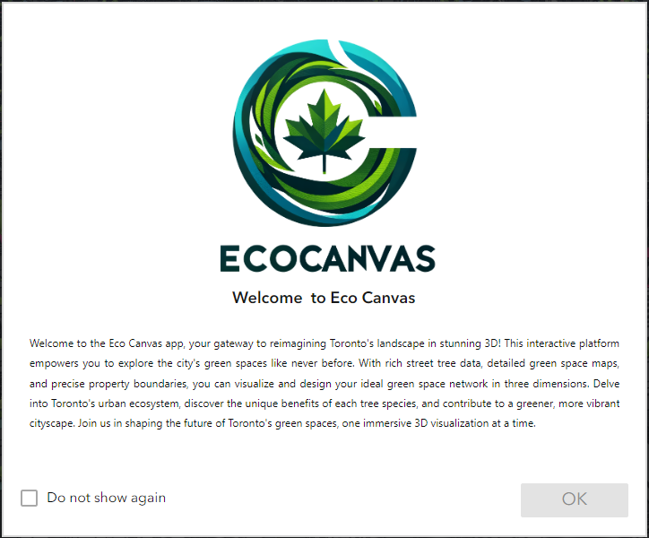
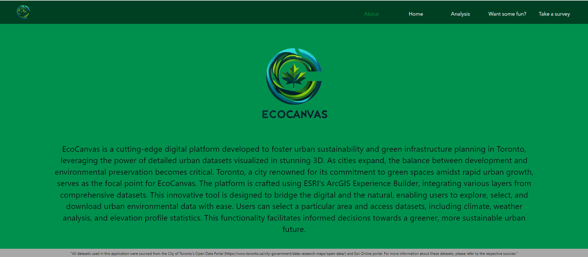
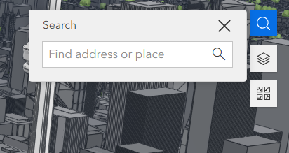
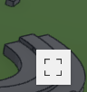
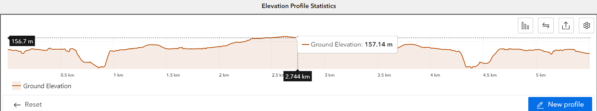
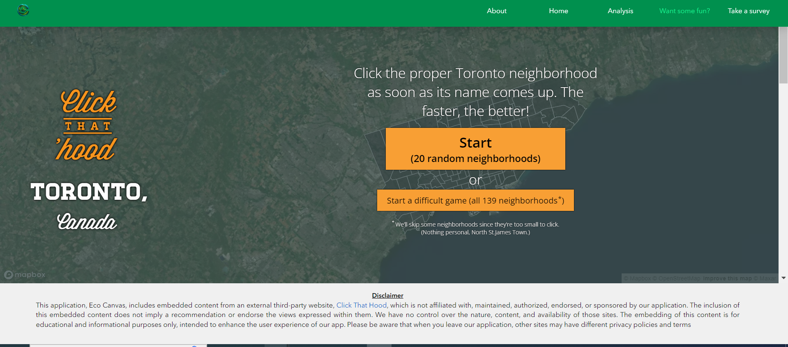
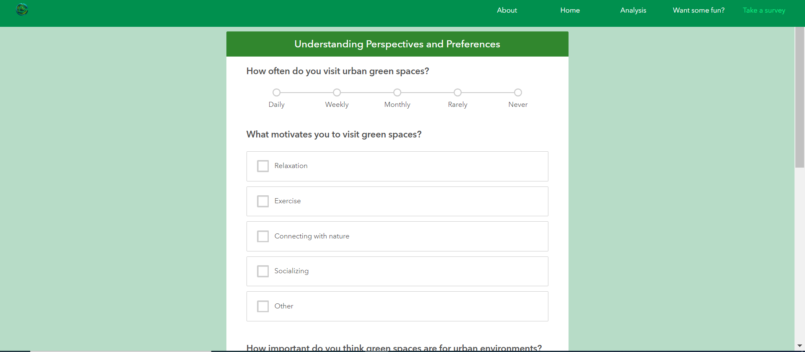
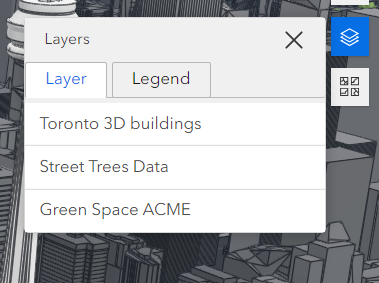
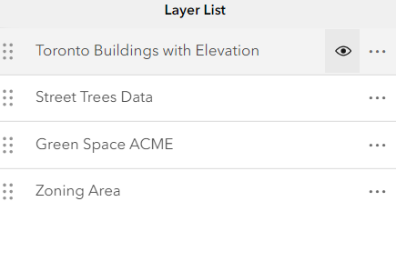
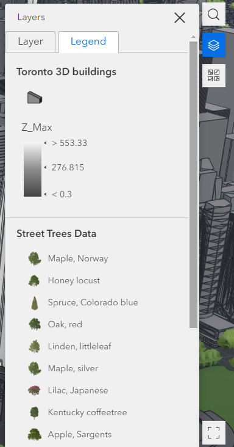

# **ECCE App Challenge 2024**
## **Team Acme - Centre of Geographic Sciences (COGS) - NSCC**
- Sanita Richards
- Abubakar Lasisi
- Ashwin Chandrasekar

## **About EcoCanvas**

EcoCanvas is a cutting-edge digital platform developed to foster urban sustainability and green infrastructure planning in Toronto, leveraging the power of detailed urban datasets visualized in stunning 3D. As cities expand, the balance between development and environmental preservation becomes critical. Toronto, a city renowned for its commitment to green spaces amidst rapid urban growth, serves as the focal point for EcoCanvas. The platform is crafted using ESRI's ArcGIS Experience Builder, integrating various layers from comprehensive datasets. This innovative tool is designed to bridge the digital and the natural, enabling users to explore, select, and download urban environmental data with ease. Users can select a particular area and access datasets, including climate, weather analysis, and elevation profile statistics. This functionality facilitates informed decisions towards a greener, more sustainable urban future.

# **Mission Statement**

"EcoCanvas is committed to democratizing access to urban environmental data, empowering citizens, urban planners, and policymakers to collaboratively shape a verdant, sustainable Toronto. Through providing accessible, user-friendly urban green space, street trees, and zoning datasets, EcoCanvas ignites environmental stewardship, fosters urban biodiversity, and promotes community well-being."

# **Scope**

### **Focusing on Toronto, EcoCanvas delivers:**

### **Urban Green Space Data:** 
Offering insights into parks, gardens, and green areas to enhance urban green coverage.

### **Street Trees Data:** 
Detailing the distribution, species, and health of Toronto's urban forestry, aiding conservation and expansion efforts.

### **Zoning Data:** 
Providing essential zoning information to inform sustainable development and land use planning.

Built on the robust framework of ESRI's ArcGIS Experience Builder, EcoCanvas integrates dynamic layers from rich datasets, ensuring a comprehensive and interactive experience for users.

## **Toronto's Greenery in Context**

Toronto stands as a beacon of urban greenery in Canada, with over 10% of its land area covered by parks and natural spaces. The city's ambitious "Million Trees" initiative and other green infrastructure projects reflect a strong commitment to expanding and enhancing these vital urban lungs. Despite the pressures of urban expansion, Toronto's dedication to green space development serves as a model for cities worldwide, highlighting the importance of integrating nature into urban planning. 

## **EcoCanvas and Toronto's Urban Expansion**

EcoCanvas emerges at a critical time when Toronto's urban landscape is evolving rapidly. The app's utilization of ESRI's ArcGIS Experience Builder to create a user-friendly interface with layers from comprehensive datasets allows for an unprecedented level of engagement with Toronto's green infrastructure. By making urban environmental data accessible and actionable, EcoCanvas plays a pivotal role in supporting Toronto's journey towards sustainable urban growth, aligning with the city's green initiatives and contributing to the development of a resilient, livable urban environment.

# Technologies Used
- App: EcoCanvas utilizes Esri Technology and Open Street Map public datasets to create a customized mapping application providing users with detailed information on Toronto's Zonining area, Street Trees, Parks, Open Space and Buildings. The technology used includes ArcGIS Pro, ArcGIS Online, ArcGIS Experience Builder, ArcGIS Survey 123, and ArcGIS Scene Viewer.
- Logo: we used DALL-E 3
- Video: For Intro we used Invideo.io.

# User Guide
This guide provides an overview of the features and functionalities available on the platform, helping users navigate and utilize its capabilities effectively.
### Default View:
- User is prompted to click "Agree to terms and conditions" in a splash display to take user to the homepage.

  

### About Tab:
- This speaks about our app and what we aim to achieve.
  

### Home Tab: 
- On the homepage, User can** search** and explore Toronto's municipality in a 3D view.
  

  
- Clicking on a building, space, trees, or basically any polygon provides information as a configured pop-up like name (common, botanical name), location, heights, zoning properties and its purpose etc.
- The basemap tool allows users to change the basemap bases on their preference.

- Fullscreen option

   

### Analysis Tab:

On the Analysis tab,
- Users can utilize a 3D tool to draw a polygon and select any area of interest for elevation profile analysis.
- The graph is displayed based on user's selected area.

- The analyzed data can be downloaded in 3 file formats (.json, .Geojson, .csv) to your local directory or user's ESRI account.
- This feature is live, ensuring real-time data updates.
- Selected area can be zoomed in to analyze specific areas.
- User can be able to visualize weather conditions like the sun shadow intensity, snow, and rain, cloud cover.
- User can adjust transparency and precipitation.

### Fun Part:

- User can enjoy a gaming experience integrated into the platform.

### Survey:
- User can participate in a survey about green spaces to contribute valuable feedback.
  

- The completed survey data is saved to an AGOL account 

### Layers

- Layers can be turned on and off for specific visualization.

### Legend

# Limitation
- When you select an area, you can export the data in different formats like .json, .csv, Geojson, or others to your computer. However, the .csv file isn't useful because the dataset includes points meant for 3D visualization.
- If you come across a triangle warning, simply disregard it; it is caused by graphics limitations on the display.
- Please note that the platform is not optimized for mobile devices or smaller screens.

# AppLink
- EcoCanvas App [https://experience.arcgis.com/experience/e98d5bef9ee64d769bcd8eef95a25569/page/About/?data_id=dataSource_1-18df091727c-layer-70%3A5356&draft=true]
  
# Geospatial Open Data Sources and References
- City of Toronto Open Data Portal [https://open.toronto.ca/]
- Toronto's Open Data [https://open.toronto.ca/dataset/3d-massing/]
- Toronto's Trees data [https://open.toronto.ca/dataset/street-tree-data/]
- Toronto's Green spaces [https://open.toronto.ca/dataset/green-spaces/]
- Toronto's Zone Area Data [https://open.toronto.ca/dataset/zoning-by-law/]
  

- Arcade Text Functions: [https://developers.arcgis.com/arcade/function-reference/text_functions/]
- Video Voiceover - AI

# Images
Resource Images: [Images](https://github.com/EsriCanada-CE/ecce-app-challenge-2024/tree/4c8b92b3b4fd0b1572e36972fad9e5b498f799ef/Team_ACME/images)

# Videos
EcoCanvas Video: https://www.youtube.com/watch?v=HIGgPnoiG24&list=PLdgq5G0ox73UY-EJlU9AQmJ5YksqNVb8H
