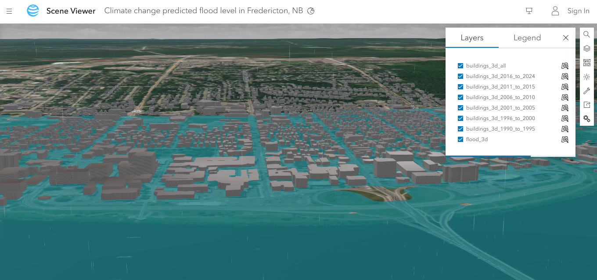
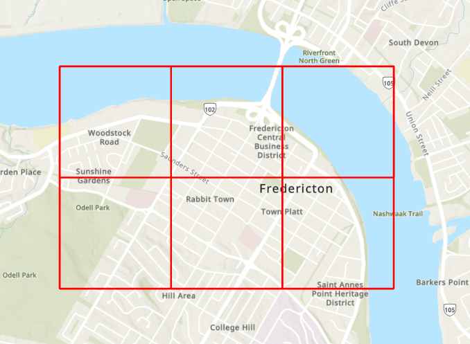
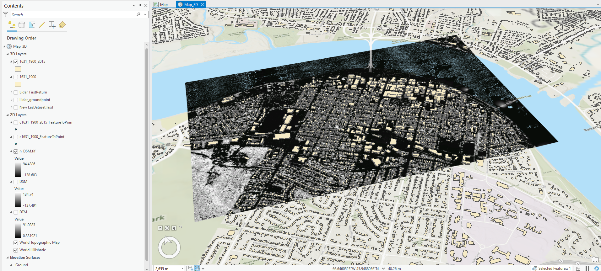
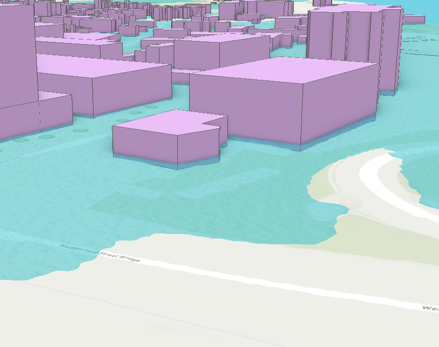

# Climate change predicted flood level in Fredericton, NB Explorer 
## by Team UNB
Welcome to our **3D Web Scene** exploring the critical intersection of urban expansion, flood model, and climate change. As cities worldwide experience rapid growth and development, there needs to be an attention to the flood levels impacted by climate change. This interactive platform delves into the dynamic relationship between urban expansion and flood risk within the context of a changing climate.

# The application is dedicated to

**Enhanced Spatial Visualization**: Our advanced 3D mapping capabilities provide stakeholders with a comprehensive understanding of urban environments, enabling them to assess climate change related flood risks with clarity and precision.

**Fostering Community Engagement**: We recognize the importance of inclusive engagement in fostering community resilience. Our application facilitates collaboration among individuals, local authorities, and urban planners, empowering communities to address the challenges posed by urban development and flooding together.

**Advocating for Sustainable Urban Development**: We advocate for informed decision-making and risk-aware planning to promote sustainable urban development practices. Our application equips stakeholders with the necessary tools and insights to strike a balance between growth imperatives and environmental stewardship, fostering resilience in urban landscapes.

**Commitment to Continuous Innovation**: We are committed to advancing flood prediction and 3D urban visualization technology. Through ongoing research and development efforts, we strive to enhance the capabilities of our application, ensuring it remains a pioneering solution in the realm of urban resilience.

## App overview
The 'Fredericton Climate Change 3D FloodWatch' will provide an overview of the predicted flood levels for the year 2100 in downtown Fredericton, New Brunswick, due to climate change. We have summarized the data for the recent buildings constructed 3D buildings in Fredericton, NB, including essential features such as flood depth, building height, age, and address. These buildings are at risk of being submerged by flood events in 2100.
Given the trends in climate change, urban development, including impermeable paving, is exacerbating the city's vulnerability to flooding. Factors such as heavy rainfall, rapid snowmelt, ice jams, storm surges, and climate change are increasing the risk of flooding in Fredericton in the coming decades. The integrated 3D flood model, combined with the 3D building model, offers decision-makers a strategic framework for planning and implementation. This framework includes a timeline for action to address the challenges posed by future flooding events.

## Offline Map
Utilizing the Lidar point cloud data gathered via the GEONB platform, we conducted an analysis to manage urban expansion and flood risk within a 3D scene. This section elucidates the detailed process involved in processing this database and generating the 3D scene Web App.

1. Lidar Point Cloud Collection: The Lidar point cloud was systematically collected within the central area of downtown Fredericton, near the Saint John River. This strategic collection site resides within a flood zone, offering a clear depiction of flood behavior around buildings and residential areas.

2. Elevation Model Creation and Building Height Calculation: The Lidar point cloud underwent classification into distinct categories:
o    Ground Points: Aimed at acquiring ground-level data to generate a Digital Terrain Model (DTM).
o    First Return Points: Representing the foremost laser pulse returns, capturing significant landscape features such as treetops or building summits to construct a Digital Surface Model (DSM). Leveraging the DTM and DSM obtained in prior stages, a normalized DSM (n_DSM) was generated by subtracting DTM values from DSM values, yielding the building height data.

3. Footprint Data Compilation and Urban Expansion Analysis: Historical footprint data sourced from Fredericton city archives spanning from 1631 to 2024 were collected and categorized into distinct periods to observe urban expansion trends. The previously calculated building height data was directly integrated into the footprint polygons, facilitating the extrusion of 3D buildings.

4. Predictable Flood Model Integration: A flood model depicting the projected flood scenario for 2100, obtained from the GENB platform, with an average water level of approximately 9 meters was incorporated. Consequently, a 3D flood model was developed, reflecting a 9-meter elevation in water levels by the year 2100.

Upon completion of the process, the 3D building and flood models were overlaid, illustrating the inundation impact on each building. This information is accessible via the attribute table of each building, featuring a designated field titled 'Flood Depth'.

#  App Features
You can view the 3D model from a global or local perspective and observe it from different angles, including along the flood zone. 

The layer displays 3D buildings in Fredericton downtown across different time periods, emphasizing urban expansion over time.

The base map feature allows users to choose different types of base maps to enhance the usability and interpretability of 3D scenes by providing essential spatial context and visual reference points. 

Ground transparency enables users to see subsurface data under the base map, such as earthquake or geological rock types.

Sunlight and shading effects in the scene enhance the appearance of 3D buildings and flood models, making them more realistic. 

The weather sectors offer multiple choices for different weather conditions, adding versatility and depth to the virtual environment, serving various purposes from visual enhancement to scientific simulations.

Scene tools assist in calculating and displaying measurement elements in the 3D scene, including 3D buildings, flood areas, actual study area size, topographic prominence of hills and mountain ranges, and visualizing the distance between map features to deepen understanding of spatial relationships.

The share button facilitates easy sharing of the current view of the 3D scene with others, convenient for collaborative projects, presentations, and sharing findings with colleagues or stakeholders. 

Users can adjust settings of the 3D view to optimize graphics for performance and quality.

The initial view feature allows users to return to where the camera is positioned and oriented within the 3D scene, determining the initial view when they first access the scene.

3D navigation tools help users pan, zoom, rotate, and tilt the view within the 3D scene. Users can also adjust the view to display the entire extent of the data within the scene, providing a quick overview of the entire 3D environment or dataset. The toggle allows users to switch between panning and rotating modes, providing flexibility in navigation. 

The reset map orientation button allows users to return the view to its orientation or predefined orientation. 

#  References

**Open Source Data**
1. Lidar Point Cloud : https://geonb.snb.ca/li/
2. Footprint building and Flood model: http://www.snb.ca/geonb1/e/DC/catalogue-E.asp
   
**Online Articles & Websites**

1. The risk of floods: https://www.canada.ca/en/campaign/flood-ready/know-the-risks/risk-floods.html
2. Floods in Canada: https://www.thecanadianencyclopedia.ca/en/article/floods-and-flood-control
3. New Brunswick’s Flood Maps: https://www2.gnb.ca/content/gnb/en/departments/elg/environment/content/flood/flood_maps.html
4. State of the Global Climate 2021: https://wmo.int/publication-series/state-of-global-climate-2021
5. Canada floods: 18,000 people still stranded in ‘terrible, terrible disaster’: https://www.theguardian.com/world/2021/nov/18/residents-brace-for-torrential-rains-in-already-flooded-western-canada
6. Flooding forces hundreds of evacuations as Quebec towns declare states of emergency: https://www.cbc.ca/news/canada/montreal/quebec-municipalities-declare-state-of-emergency-flooding-1.6829099
7. How climate change is making record-breaking floods the new normal: https://www.unep.org/news-and-stories/story/how-climate-change-making-record-breaking-floods-new-normal

**Image**

1. Saint John River continue rising in Grand Lake, N.B. on May 2, 2018: https://atlantic.ctvnews.ca/record-floods-show-world-has-changed-and-n-b-must-adapt-scientists-say-1.3918250
2. Top weather disasters Canada 2017: https://www.rcinet.ca/en/2018/01/15/top-weather-disasters-canada-2017/
3. Hurricane Gustav September 10, 2002: https://www.weather.gov/mhx/Sep102002EventReview
4. Long-term Infrastructure: https://www.acec-nb.ca/long-term-infrastructure.html
5. Largest auto insurer in New Brunswick: https://www.cbc.ca/news/canada/new-brunswick/car-insurance-new-brunswick-credit-score-1.6170381
6. Land Use Planning: https://www2.gnb.ca/content/gnb/en/corporate/promo/local-governance/path-forward.html
7. Moncton market: https://www.cbc.ca/news/canada/new-brunswick/downtown-moncton-library-event-centre-jim-scott-1.4156257
8. Odell Park and Odell Arboretum: https://www.ferries.ca/new-brunswick-daycation-ideas/
9. Lighthouse overlooking the Saint John River downtown Fredericton: https://globalnews.ca/news/4859817/new-brunswick-extreme-cold-warning/
10. Protesters: https://www.ktvq.com/news/crime-watch/protesters-rally-against-billings-daycare-after-employee-charged-with-sexual-assault-of-minor

**Video**

1. ArcGIS Scene Viewer - Layer Style for Points: https://www.youtube.com/watch?v=ZczsaIgvm4U
2. ArcGIS Online - Scene Basics: https://www.youtube.com/watch?v=ISmCg4abo-E

