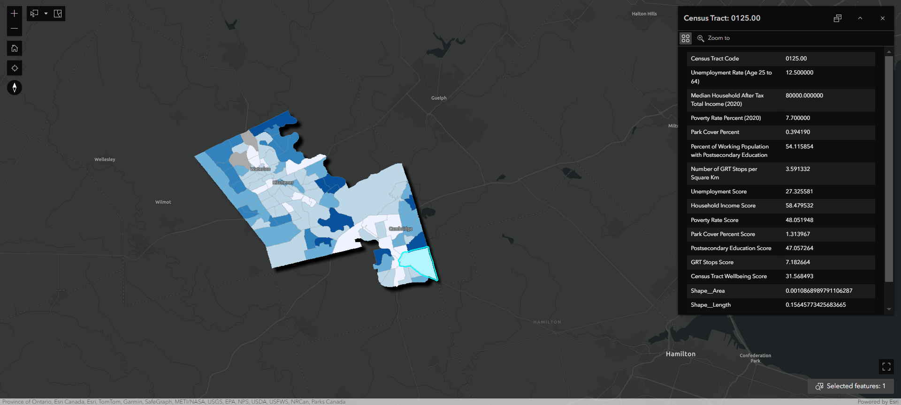
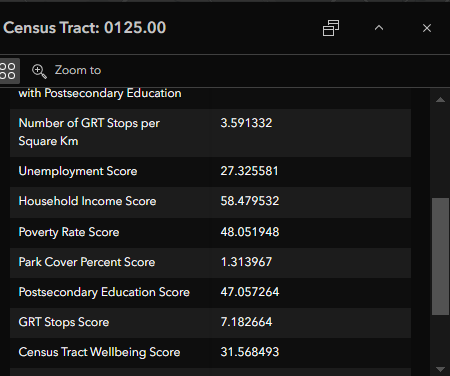
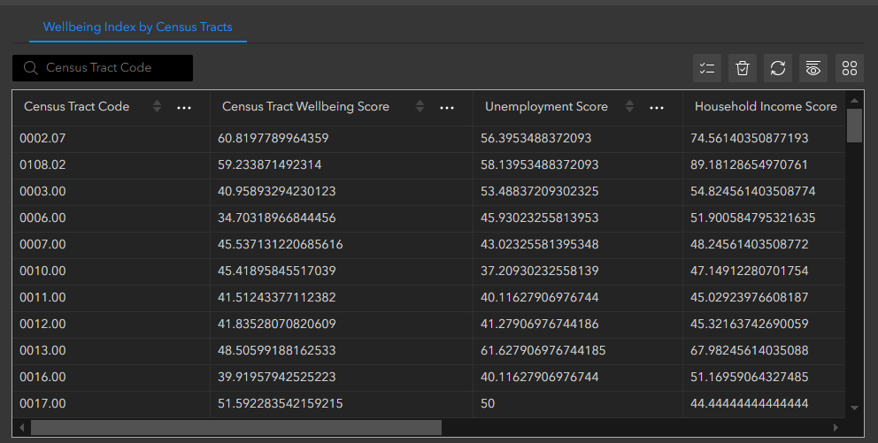
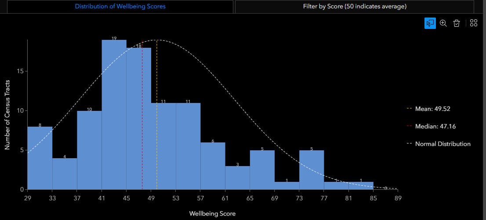
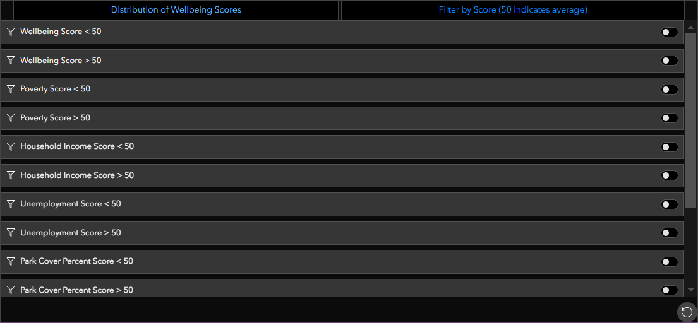

# The Tri-City Wellbeing Warriors

## Team Members
- SeungWon Jun
- Judy Ye
- Gagandeep (Deep) Singh

## Our Mission Statement
The Tri-City Wellbeing Initiative leverages various indicators of community health and spatial visualization to create a seamless portal for education. This supports community planning decision-makers in effectively designating resources to aid in the equitable growth of the Kitchener-Waterloo-Cambridge (KWC) area. Moreover, it builds a repertoire for businesses and residents alike to learn more about their neighbourhoods. Specifically helping to curate business decisions for their customers, make more informed decisions when moving, and better understand the socio-economic diversity in their communities. To achieve this, the Wellbeing platform highlights key metrics such as social health, green space, and community demographics. Where the combination of these indicators creates an overall wellbeing index, scoring a community based on various facets of social health. 

## Our Statement of Characteristics 
The Tri-City Wellbeing Initiative combines various metrics of social urban wellbeing into one platform. Standard indicator-based initiatives struggle to deliver an interactive approach to understanding community demographics. The interactive map creates a comprehensive visualization of census tracts across the Kitchener-Waterloo-Cambridge area. Where each polygon represents a census tract, color-scaled according to its wellbeing index. Blue indicates highest score, and white indicates lowest score. The wellbeing index, is a synthesis of six key variables, provides a holistic understanding of community health. These variables include unemployment rate, median household income, poverty rate, education level, green space coverage, and public transport accessibility. It leverages these key metrics against national averages which provides a strong benchmark for urban development and social wellbeing. 

The map visualization enables pop-up windows which offer insights into individual metrics, empowering decision-makers with valuable data needed to support their communities. Moreover, users can explore tabular data showcasing the scores for each variable per census tract. The search bar provides a means for easy navigation, enabling users to delve deeper into specific communities. Beyond the map visualization, the graphical tabs near the bottom of the application provides another method to interpret the distribution of urban wellbeing in the KWC area. The first is a chart, showing the overall distribution of wellbeing scores along with their mean and median values. Users can hover over each bar in the histogram for more detail. This enables users to target specific metrics across the Kitchener-Waterloo-Cambridge area. Moreover, by adjusting filters, users can compare neighborhoods and identify areas in need of greater resources. Thus, the combination of multiple social indicators in one resource is an excellent educational resource for decision-makers, residents and businesses in the KWC area. The easy-to-understand colour-scaled map, visual graphs and ability to explore data separates this tool from other wellbeing indexes. In which the end user can control the metrics that are important to them, learning more about their own neighbourhood, and building social awareness to improve urban quality of life. 

## User Guide 

## Map Overview
The base map highlights the various census tracts across Kitchener-Waterloo-Cambridge. Attached with census tract data and data derived from analysis of Region of Waterloo Open Data shapefiles, these census tract polygons are colour scaled according to their wellbeing index. The calculation of wellbeing is a summarized normal of 6 variables; unemployment rate, median household income, poverty rate, % working population with postsecondary education, % green space (park) coverage, and rate of public transit stops per sq. km. These variables are measured against Canadian national averages respectively, resulting in values of 0 through 100, with 50 being right at the national average. Areas highlighted in the darker hue represent communities that are overall surpassing national averages and are thus equitably growing in various departments of social health. Communities in the lighter hues are neighbourhoods that are struggling with these social indexes, resulting in poorer urban health results. Moreover, these communities represent an opportunity by decision-makers to better allocate resources in response to urban expansion.

Selecting a specific census tract will provide pop-up information about the community. 

## Table & Statistics

The tabular information present at the bottom of the application highlights specific information for each census tract, and their individual wellbeing scores in regard to the 6 variables identified. Moreover, the histogram plots the wellbeing scores of the census tracts, as well as enables filtering for scores below or above 50 (the national average). 

The filtering option enables users to target specific metrics across KWC and learn more about how they vary across each census tract. This allows for a better comparison between differing neighbourhoods, and areas that may require greater resources. 

## Wellbeing Formula/Criteria

### Poverty Index 
Resource:
https://www.canada.ca/en/employment-social-development/programs/poverty-reduction/national-advisory-council/reports/2023-annual.html
- Index = 50 + 50( (national avg - census tract avg) / national avg )
- 2021 national average poverty rate is 7.4%
- Index score of 50 indicates that census tract average is the same value as national average
  - Higher score than 50 = Lower poverty rate than average
  - Lower score than 50 = Higher poverty rate than average

### Unemployment Index
Resource: 
https://www150.statcan.gc.ca/t1/tbl1/en/cv.action?pid=9810048501
- Index = 50 + 50( (national avg - census tract avg) / national avg )
- 2021 national average unemployment rate for people aged 25~64 (both men and women) was 8.6%
- Index score of 50 indicates that census tract average is the same value as national average
  - Higher score than 50 = Lower unemployment rate than average
  - Lower score than 50 = Higher unemployment rate than average

### Household Income Index
Resource: 
https://www150.statcan.gc.ca/t1/tbl1/en/cv.action?pid=9810005801
- Index = 50 + 50( (census tract avg - national avg) / national avg )
- 2021 national household average after-tax income was $68,400 (Statistics Canada)
- Index score of 50 indicates that census tract average is the same value as national average
  - Higher score than 50 = Higher household after-tax income than average
  - Lower score than 50 = Lower household after-tax income than average

### Education Index 
Resource:
https://www150.statcan.gc.ca/n1/daily-quotidien/221130/dq221130a-eng.htm
- Index = 50 + 50( (census tract avg - national avg) / national avg)
- Average of working-age people (aged 25 to 64) in Canada with a postsecondary education credential was 57.5%
- Index score of 50 indicates that census tract average is the same value as national average
  - Higher score than 50 = Greater education than average
  - Lower score than 50 = Less education than average

### Green Space Index
Resource: 
https://unhabitat.org/sites/default/files/2020/08/streets_as_public_spaces_and_drivers_of_urban_prosperity.pdf
- ⁠Index = 50 + 50( (census tract avg - national avg) / national avg)
- Recommended greenspace allocation is at least 15%
- Index score of 50 indicates that census tract greenspace allocation is exactly 15%
  - Higher score than 50 = Better greenspace allocation than 15%
  - Lower score than 50 = Worse greenspace allocation than 15%

### GRT – Public Transport Index
Resource: 
https://www.thelancet.com/journals/langlo/article/PIIS2214-109X(22)00068-7/fulltext
- ⁠Index = 50 + 50( (census tract avg - national avg) / national avg)
- Average number of public transport stops per square Km should be 25
- Index score of 50 indicates that number of public transport stops per square Km in that census tract is exactly 25
  - Higher score than 50 = Better public transport stops distribution than 25 per square Km
  - Lower score than 50 = Worse public transport stops distribution than 25 per square Km

### Wellbeing Index Score
- Calculated as an average of the sum of scores above
- Index = ( (Poverty Score + Unemployment Score + Household Income Score + Education Score + Green Space Score + GRT Public Transport Score) / 6 )

